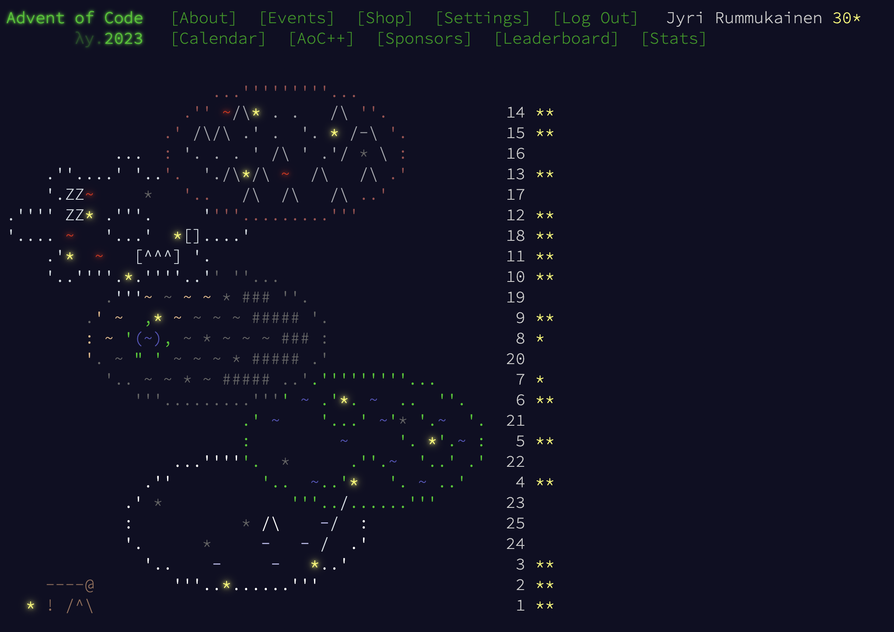

2024 update:
While I am not aiming to leaderboard in anyway, I still wrote a script to help with getting started. Usage of the script is fairly simple and feel free to do so.
If you decide to use it, couple things I could mention.
You have to hardcode AOC_SESSION variable in your ~/.bashrc file like this 
``` export AOC_SESSION="insert_your_aoc_session_token_here" ```
and pre running it, everytime when terminal is opened run the command
``` source ~/.bashrc ```

Templates that I use are really generic templates and can be customized to your preferences, mine just tend to lean towards what was normal in my school.

While it is allowed, and along the rules of the competion, I highly doubt this will boost your times, just saves the hazzle of importing input, and keeps repository kinda organized without single thought at 6:00AM.
Happy holidays! -Jyri Rummukainen


