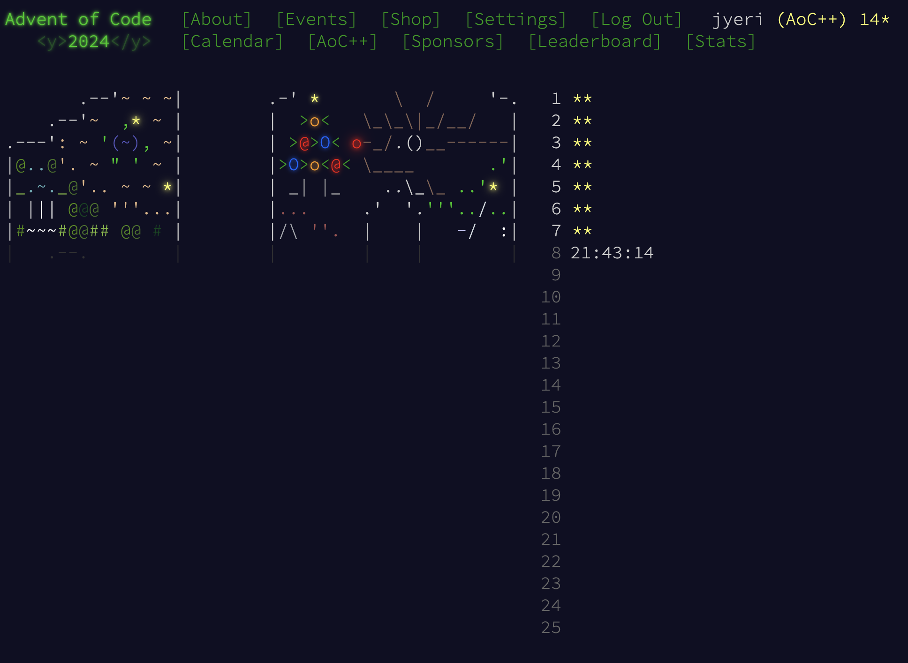
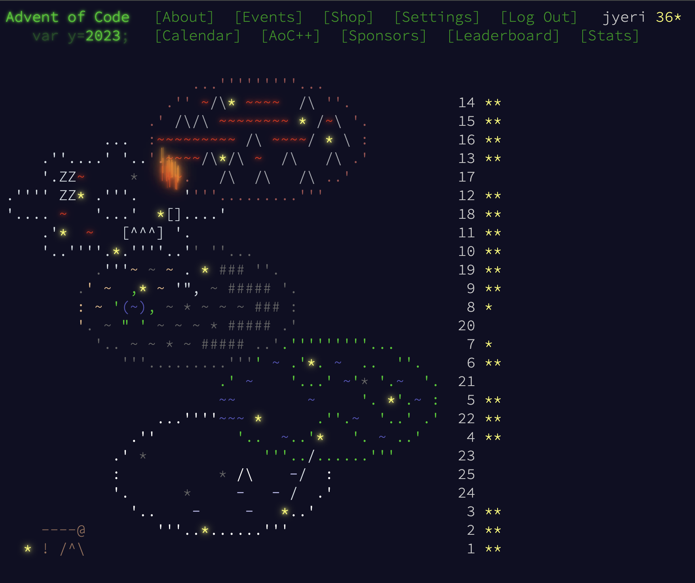

# Advent of Code
yearly christmas calendar that every single puzzlesolver will enjoy, I guarantee it. I am not aiming to leaderboards, but enjoy doin the puzzles anyway. Results that I have provided are not optimized to the teeth, but are something that im proud to call mine!

## Content
- [Script](#script)
- [2024](#2023)
- [2023](#2023)

## Script
While I am not aiming to leaderboard in anyway, I still wrote a script to help with getting started Simply because it is fun. Usage of the script is fairly simple and feel free to do so.
If you decide to use it, couple things I could mention.
1. move the script (AOC_FILES.sh) to the yearly folder, in my case its located

``` root/2024/AOC_FILES.sh ```

2. You have to hardcode AOC_SESSION variable in your ~/.bashrc file like this 

``` export AOC_SESSION="insert_your_aoc_session_token_here" ```

3. before running the script, everytime when terminal is opened run the command

``` source ~/.bashrc ```

4. Templates that I use are really generic templates and can be customized to your preferences, mine just tend to lean towards what was normal in my school.

5. While it is allowed, and along the rules of the competion, I highly doubt this will boost your times, just saves the hazzle of importing input, and keeps repository kinda organized without single thought at 6:00AM.


## 2024
- Decided to challenge myself by moving from comfortzone of C to first solving the puzzles using JavaScript and after that with C.
- Still ongoing, have been ranked between 2000 and 10000 depending on date, not that it matters.




## 2023
- My first year of actually participating, instead on doing task from here and there.
- Did it with C language, tried to provide comments why i ended up with unefficient solutions :D


